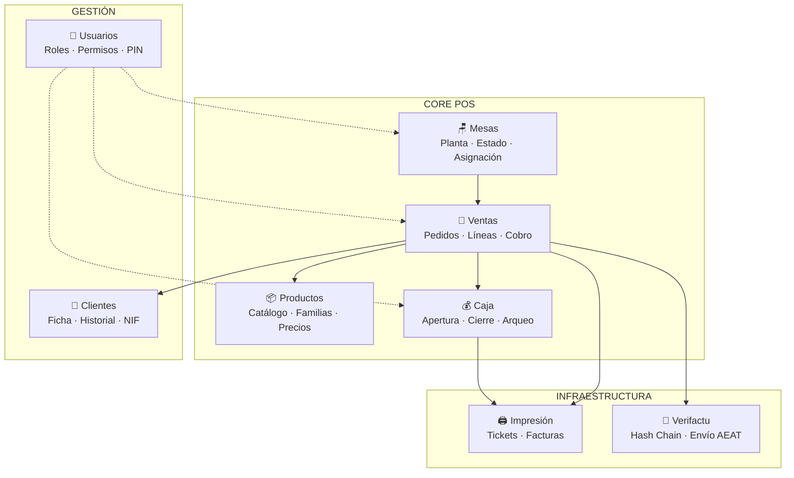
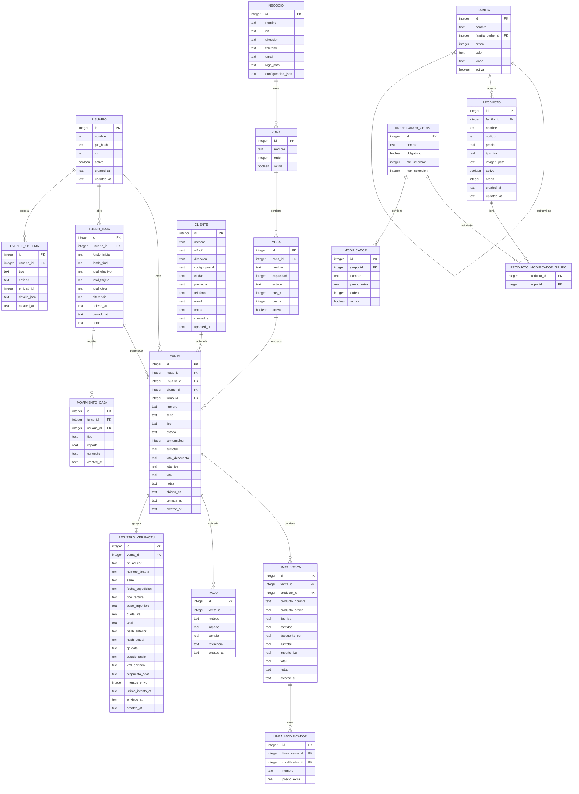
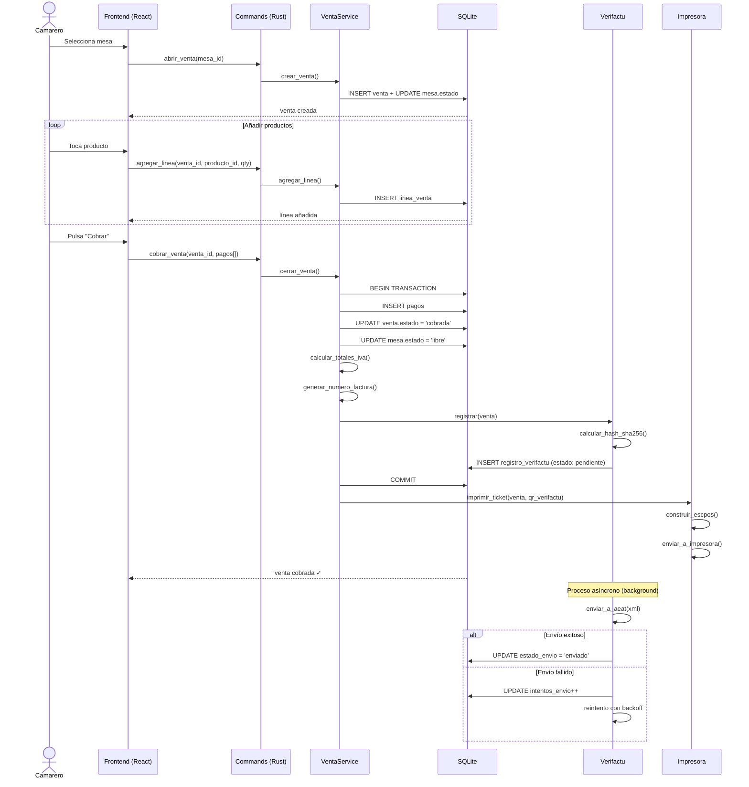
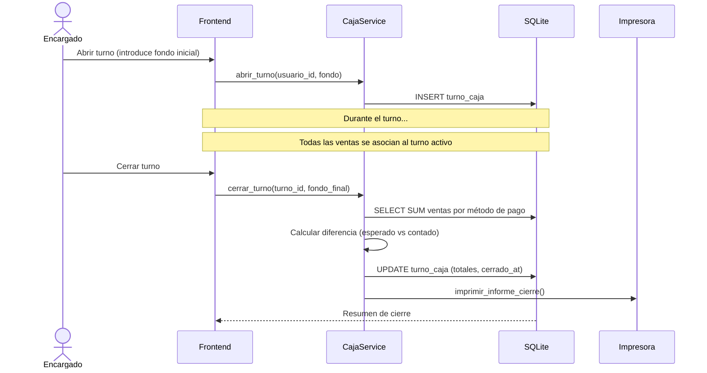
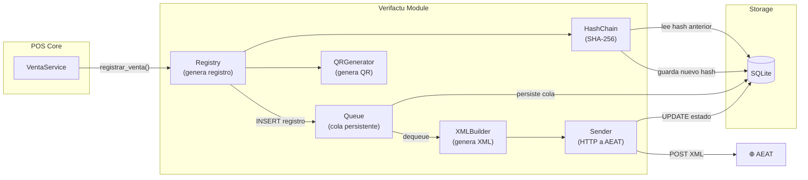

# Tormel POS — Arquitectura del Sistema

Documento de arquitectura para un TPV de escritorio offline-first orientado a bares, restaurantes y cafeterías. Diseñado para camareros: gestión de mesas, ventas, productos, clientes, caja, impresión de tickets, usuarios y facturación con Verifactu.

---

## 1. Decisiones Tecnológicas Fundamentales

### 1.1 Framework de Escritorio: Tauri 2 (Rust + React/TypeScript)

| Criterio | Tauri 2 | Electron |
|:---|:---|:---|
| **Tamaño del binario** | ~3-10 MB | ~120-200 MB |
| **Consumo de RAM** | ~30-80 MB idle | ~150-400 MB idle |
| **Arranque** | <200ms | 2-5 segundos |
| **Backend** | Rust (nativo, seguro) | Node.js |
| **Seguridad** | Modelo de capabilities | Acceso completo al sistema |

**Decisión: Tauri 2.** Razones:

1. **Rendimiento en hardware POS real.** Los TPVs suelen ejecutarse en tablets o PCs modestos. 30 MB de RAM vs 300 MB es crítico. El arranque instantáneo (<200ms) es imprescindible — un camarero no puede esperar 5 segundos para abrir la caja.
2. **Backend en Rust.** SQLite, hashing SHA-256, firma electrónica y comunicación con impresoras térmicas son operaciones nativas donde Rust es imbatible. No necesitamos bindings de Node.js ni C++.
3. **Seguridad.** El modelo de capabilities de Tauri restringe exactamente qué APIs del sistema puede usar el frontend. En un POS con datos fiscales, esto no es opcional.
4. **Distribución.** Un binario de 10 MB se despliega y actualiza en segundos. Ideal para un restaurante con conexión limitada.

> [!NOTE]
> El frontend será **React + TypeScript** con Vite como bundler. React por su ecosistema maduro, TypeScript por la seguridad de tipos, y Vite porque es el bundler nativo de Tauri 2.

---

### 1.2 Almacenamiento Local: SQLite (archivo único)

**Descarto un archivo JSON propio.** Estas son las razones:

| Criterio | JSON File | SQLite |
|:---|:---|:---|
| **Integridad ante cortes de luz** | ❌ Corrupción probable | ✅ ACID, WAL journal |
| **Queries parciales** | ❌ Parsear todo el archivo | ✅ Índices B-tree, lectura selectiva |
| **Concurrencia** | ❌ Lock manual del archivo | ✅ WAL mode (lecturas + escritura simultáneas) |
| **Escalabilidad** | ❌ Degrada con >10K registros | ✅ Millones de registros sin problema |
| **Memoria** | ❌ Todo en RAM | ✅ Solo lo necesario |
| **Backup** | ✅ Copiar archivo | ✅ Copiar archivo (idéntico) |
| **JSON dentro de SQL** | N/A | ✅ `json_extract()`, indexable |

**Decisión: SQLite en modo WAL.**

Un restaurante genera ~200-500 tickets/día. En un año son ~150K registros. JSON requeriría parsear todo ese archivo para cada consulta. SQLite lo resuelve en microsegundos con índices.

El argumento decisivo es la **integridad**: un corte de luz con un JSON a medio escribir = datos perdidos. SQLite con WAL garantiza transacciones atómicas. Para un negocio, perder un turno de caja es inaceptable.

**Implementación:** `rusqlite` (Rust, síncrono, directo). No `tauri-plugin-sql` — queremos control total sobre migraciones, transacciones y el hash chain de Verifactu desde el backend Rust.

> [!IMPORTANT]
> El archivo SQLite se almacenará en `{app_data}/tormel/negocio.db`. Un solo archivo = fácil backup, fácil migración, fácil restauración. Se incluirá un mecanismo de backup automático antes de cada migración de esquema.

---

### 1.3 Impresión de Tickets: ESC/POS nativo desde Rust

**Decisión:** Comunicación directa con impresoras térmicas ESC/POS a través de puertos serial/USB desde Rust, usando la crate `serialport` y construyendo los comandos ESC/POS internamente.

Razones:
- Control total sobre el formato del ticket (logo, QR Verifactu, corte de papel).
- Sin dependencia de drivers del sistema ni APIs de impresión de Windows.
- Soporte directo a las impresoras térmicas más comunes en hostelería (Epson TM, Star TSP, Bixolon).

---

## 2. Arquitectura de Software

### 2.1 Principio General: Clean Architecture Pragmática

Aplicamos Clean Architecture con una regla clara: **la complejidad debe justificarse**. No creamos abstracciones "por si acaso". Cada capa existe porque resuelve un problema concreto.

```
┌─────────────────────────────────────────────────────────┐
│                    FRONTEND (React/TS)                   │
│  Componentes UI · Estado local · Llamadas IPC a Tauri   │
└────────────────────────┬────────────────────────────────┘
                         │ IPC (invoke)
┌────────────────────────▼────────────────────────────────┐
│                COMMANDS LAYER (Rust)                     │
│  Tauri Commands · Validación de entrada · DTO mapping   │
├─────────────────────────────────────────────────────────┤
│                 SERVICE LAYER (Rust)                     │
│  Lógica de negocio · Reglas del POS · Coordinación      │
├─────────────────────────────────────────────────────────┤
│               REPOSITORY LAYER (Rust)                   │
│  Acceso a datos · Queries SQL · Transacciones           │
├─────────────────────────────────────────────────────────┤
│                  INFRASTRUCTURE (Rust)                   │
│  SQLite · Impresora ESC/POS · Verifactu Adapter         │
└─────────────────────────────────────────────────────────┘
```

### 2.2 Capas del Backend (Rust)

#### Capa 1: Commands (Interface Adapters)
- Funciones `#[tauri::command]` que el frontend invoca vía IPC.
- Responsabilidad: deserializar entrada, validar formatos, llamar al servicio, serializar respuesta.
- **No contiene lógica de negocio.**

#### Capa 2: Services (Application/Use Cases)
- Lógica de negocio pura: abrir mesa, añadir línea a pedido, cerrar venta, cuadrar caja, generar ticket.
- Orquesta repositorios y adaptadores de infraestructura.
- Ejemplo: `VentaService::cerrar_venta()` → calcula totales → genera registro Verifactu → persiste en BD → encola impresión.

#### Capa 3: Repositories (Data Access)
- Encapsula todo el SQL. El servicio nunca ve una query SQL.
- Traits definidos en la capa de servicio, implementados aquí (inversión de dependencias).
- Gestión de transacciones SQLite.

#### Capa 4: Infrastructure (External Systems)
- **SQLite:** Pool de conexiones, migraciones, WAL config.
- **Impresora ESC/POS:** Construcción de comandos binarios, comunicación serial.
- **Verifactu Adapter:** Hash chain, firma electrónica, envío a AEAT (desacoplado).

### 2.3 Frontend (React + TypeScript)

```
src/
├── components/          # Componentes UI reutilizables
│   ├── ui/              # Botones, inputs, modales, badges
│   └── layout/          # Shell, sidebar, header
├── features/            # Módulos de negocio (feature-based)
│   ├── mesas/           # Vista de planta, estado de mesas
│   ├── ventas/          # Pantalla de venta, líneas, cobro
│   ├── productos/       # Catálogo, familias, precios
│   ├── caja/            # Apertura, cierre, arqueo
│   ├── clientes/        # Ficha de cliente
│   └── usuarios/        # Login, gestión de usuarios
├── hooks/               # Custom hooks (useInvoke, useAuth...)
├── lib/                 # Utilidades, tipos compartidos
├── stores/              # Estado global (Zustand)
└── styles/              # CSS global, tokens de diseño
```

**Gestión de estado:** Zustand. Ligero, sin boilerplate, perfecto para estado de UI reactivo. Los datos maestros vienen siempre del backend vía IPC — el frontend no es fuente de verdad.

---

## 3. Módulos Funcionales del POS

### 3.1 Mapa de Módulos



### 3.2 Detalle de Cada Módulo

#### 🪑 Mesas
- Gestión visual de la planta del local (layout configurable por zonas: terraza, salón, barra).
- Estados: `libre`, `ocupada`, `reservada`, `por_cobrar`.
- Asignación de camarero a mesa.
- Unión y división de mesas.
- Historial de ocupación (hora de apertura, duración).

#### 🧾 Ventas
- Creación de venta asociada a mesa o venta directa (barra/llevar).
- Líneas de venta: producto, cantidad, precio, descuento, notas.
- Modificadores de producto (ej: "sin hielo", "extra grande").
- División de cuenta (split por persona, por producto o equitativo).
- Métodos de pago: efectivo, tarjeta, mixto.
- Propinas (opcional).
- Generación automática de ticket/factura al cobrar.

#### 📦 Productos
- Catálogo organizado por familias y subfamilias.
- Campos: nombre, precio, IVA (4%, 10%, 21%), código, imagen, activo/inactivo.
- Modificadores globales y por producto.
- Precios por franja horaria (ej: happy hour) — fase futura.
- Búsqueda rápida por nombre o código.

#### 💰 Caja
- Apertura de turno con fondo de caja inicial.
- Cierre de turno: resumen de ventas, desglose por método de pago, diferencia de caja.
- Movimientos manuales de caja (entradas/salidas no vinculadas a ventas).
- Histórico de turnos.
- Informe de cierre imprimible.

#### 👤 Clientes
- Ficha: nombre, NIF/CIF, dirección, teléfono, email.
- Historial de compras.
- Necesario para emitir facturas nominativas (requisito Verifactu).
- Búsqueda por nombre o NIF.

#### 🔐 Usuarios
- Usuarios del sistema con roles: `admin`, `encargado`, `camarero`.
- Autenticación por PIN numérico (rápido, sin teclado completo).
- Permisos por rol: quién puede abrir/cerrar caja, hacer descuentos, anular ventas, ver informes.
- Registro de quién hizo cada operación (auditoría).

#### 🖨️ Impresión
- Generación de tickets en formato ESC/POS.
- Impresión de facturas simplificadas y completas.
- Código QR de verificación Verifactu en cada ticket.
- Configuración de impresora (puerto, velocidad, ancho de papel).
- Cola de impresión con reintentos.

#### 📡 Verifactu (Desacoplado)
- Totalmente aislado del núcleo del POS.
- **Cola de envío** persistente en SQLite: las ventas se registran y se encolan para envío.
- **Hash chain SHA-256**: cada registro incluye el hash del anterior, creando cadena inmutable.
- **Campos del hash**: NIF emisor, nº factura, serie, fecha, importe total, hash anterior.
- **Modos de operación**:
  - **Verifactu (verificado)**: envío en tiempo real a la AEAT.
  - **No Verifactu**: almacenamiento local con firma electrónica cualificada.
- **Tolerancia a fallos**: si el envío falla, se reintenta. El POS sigue funcionando sin interrupción.
- **Registro de eventos**: log inmutable de operaciones (obligatorio por normativa).

---

## 4. Modelo de Datos (SQLite)

### 4.1 Diagrama Entidad-Relación



### 4.2 Notas sobre el Modelo

1. **Desnormalización intencional en `LINEA_VENTA`:** Se guarda `producto_nombre`, `producto_precio` y `tipo_iva` como snapshot. Si el producto cambia de precio mañana, las ventas históricas no se alteran. Esto es obligatorio para integridad fiscal.

2. **`REGISTRO_VERIFACTU` desacoplado:** Tiene su propio ciclo de vida (`estado_envio`: `pendiente`, `enviando`, `enviado`, `error`). La venta se completa independientemente de si el envío a AEAT tiene éxito.

3. **`EVENTO_SISTEMA`:** Log inmutable de auditoría. Obligatorio por normativa Verifactu. Registra: quién hizo qué, cuándo, sobre qué entidad. El campo `detalle_json` almacena el estado anterior/nuevo.

4. **Tipos de IVA:** 4% (superreducido), 10% (reducido, hostelería), 21% (general). Se almacena como decimal en la línea de venta para inmutabilidad.

5. **Serie de facturación:** Permite múltiples series (ej: "A" para facturas simplificadas, "B" para facturas completas). Numeración secuencial sin huecos, obligatorio por ley.

---

## 5. Estructura del Proyecto

```
tormel/
├── src-tauri/                          # Backend Rust (Tauri)
│   ├── Cargo.toml
│   ├── tauri.conf.json
│   ├── capabilities/                   # Permisos Tauri
│   │   └── default.json
│   ├── icons/
│   ├── migrations/                     # Migraciones SQL versionadas
│   │   ├── 001_initial_schema.sql
│   │   └── ...
│   └── src/
│       ├── main.rs                     # Entry point Tauri
│       ├── lib.rs                      # Setup, state, plugins
│       ├── db/                         # Infraestructura SQLite
│       │   ├── mod.rs
│       │   ├── connection.rs           # Pool, WAL config, pragmas
│       │   └── migrator.rs             # Sistema de migraciones
│       ├── commands/                   # Tauri commands (capa interface)
│       │   ├── mod.rs
│       │   ├── mesas.rs
│       │   ├── ventas.rs
│       │   ├── productos.rs
│       │   ├── caja.rs
│       │   ├── clientes.rs
│       │   ├── usuarios.rs
│       │   └── config.rs
│       ├── services/                   # Lógica de negocio
│       │   ├── mod.rs
│       │   ├── mesa_service.rs
│       │   ├── venta_service.rs
│       │   ├── producto_service.rs
│       │   ├── caja_service.rs
│       │   ├── cliente_service.rs
│       │   ├── usuario_service.rs
│       │   └── serie_service.rs        # Numeración de facturas
│       ├── repositories/               # Acceso a datos
│       │   ├── mod.rs
│       │   ├── mesa_repo.rs
│       │   ├── venta_repo.rs
│       │   ├── producto_repo.rs
│       │   ├── caja_repo.rs
│       │   ├── cliente_repo.rs
│       │   ├── usuario_repo.rs
│       │   └── evento_repo.rs
│       ├── models/                     # Structs de dominio
│       │   ├── mod.rs
│       │   ├── mesa.rs
│       │   ├── venta.rs
│       │   ├── producto.rs
│       │   ├── caja.rs
│       │   ├── cliente.rs
│       │   ├── usuario.rs
│       │   └── common.rs              # Tipos compartidos, enums
│       ├── verifactu/                  # Módulo Verifactu (aislado)
│       │   ├── mod.rs
│       │   ├── hash_chain.rs           # SHA-256, encadenamiento
│       │   ├── registry.rs             # Generación de registros
│       │   ├── queue.rs                # Cola de envío persistente
│       │   ├── sender.rs              # Comunicación con AEAT
│       │   ├── xml_builder.rs          # Generación XML según XSD
│       │   └── qr.rs                   # Generación QR para tickets
│       ├── printing/                   # Módulo de impresión (aislado)
│       │   ├── mod.rs
│       │   ├── escpos.rs              # Comandos ESC/POS
│       │   ├── ticket_builder.rs      # Composición del ticket
│       │   ├── printer.rs             # Comunicación serial/USB
│       │   └── queue.rs               # Cola de impresión
│       ├── auth/                       # Autenticación y permisos
│       │   ├── mod.rs
│       │   ├── pin.rs                  # Hash + verificación PIN
│       │   └── permissions.rs          # RBAC
│       └── error.rs                    # Tipo de error unificado
│
├── src/                                # Frontend React/TypeScript
│   ├── main.tsx                        # Entry point React
│   ├── App.tsx                         # Router principal
│   ├── components/
│   │   ├── ui/                         # Componentes base
│   │   │   ├── Button.tsx
│   │   │   ├── Input.tsx
│   │   │   ├── Modal.tsx
│   │   │   ├── NumPad.tsx             # Teclado numérico táctil
│   │   │   ├── Badge.tsx
│   │   │   └── Toast.tsx
│   │   └── layout/
│   │       ├── AppShell.tsx            # Layout principal
│   │       ├── Sidebar.tsx
│   │       └── Header.tsx
│   ├── features/
│   │   ├── mesas/
│   │   │   ├── PlantaView.tsx         # Vista de planta interactiva
│   │   │   ├── MesaCard.tsx
│   │   │   └── useMesas.ts
│   │   ├── ventas/
│   │   │   ├── VentaView.tsx          # Pantalla principal de venta
│   │   │   ├── LineaProducto.tsx
│   │   │   ├── PanelProductos.tsx     # Grid de productos por familia
│   │   │   ├── PanelCobro.tsx         # Modal de cobro
│   │   │   ├── SplitCuenta.tsx        # División de cuenta
│   │   │   └── useVenta.ts
│   │   ├── productos/
│   │   │   ├── CatalogoView.tsx
│   │   │   ├── ProductoForm.tsx
│   │   │   └── useProductos.ts
│   │   ├── caja/
│   │   │   ├── CajaView.tsx
│   │   │   ├── AperturaCaja.tsx
│   │   │   ├── CierreCaja.tsx
│   │   │   └── useCaja.ts
│   │   ├── clientes/
│   │   │   ├── ClienteView.tsx
│   │   │   ├── ClienteForm.tsx
│   │   │   └── useClientes.ts
│   │   └── usuarios/
│   │       ├── LoginView.tsx           # Pantalla de PIN
│   │       ├── UsuariosView.tsx
│   │       └── useUsuarios.ts
│   ├── hooks/
│   │   ├── useInvoke.ts               # Wrapper tipado sobre invoke()
│   │   └── useAuth.ts                 # Estado de sesión
│   ├── lib/
│   │   ├── types.ts                   # Tipos TypeScript (mirrors de Rust)
│   │   ├── constants.ts
│   │   └── format.ts                  # Formateo de moneda, fechas
│   ├── stores/
│   │   ├── authStore.ts               # Usuario actual, permisos
│   │   ├── ventaStore.ts              # Venta activa en pantalla
│   │   └── uiStore.ts                 # Estado de UI (sidebar, modales)
│   └── styles/
│       ├── index.css                   # Reset, tokens, variables CSS
│       ├── components.css
│       └── features.css
├── index.html
├── package.json
├── tsconfig.json
├── vite.config.ts
└── README.md
```

---

## 6. Flujos Clave del Sistema

### 6.1 Flujo de Venta Completa



### 6.2 Flujo de Apertura/Cierre de Caja



---

## 7. Verifactu: Diseño del Módulo Desacoplado

### 7.1 Principio de Diseño

```
El POS NUNCA espera a Verifactu para completar una operación.
Verifactu es un observador que procesa registros de forma asíncrona.
```

### 7.2 Arquitectura del Módulo



### 7.3 Hash Chain (SHA-256)

Según la especificación de la AEAT, el hash se calcula concatenando en orden estricto:

```
hash = SHA-256(
    NIF_EMISOR +
    NUMERO_FACTURA +
    SERIE +
    FECHA_EXPEDICION +
    TIPO_FACTURA +
    BASE_IMPONIBLE +
    CUOTA_IVA +
    TOTAL +
    HASH_REGISTRO_ANTERIOR
)
```

- El primer registro de la cadena usa una cadena vacía como `HASH_REGISTRO_ANTERIOR`.
- Si la cadena se rompe, se detecta inmediatamente en auditoría.
- Los hashes se almacenan permanentemente en `REGISTRO_VERIFACTU`.

### 7.4 Cola de Envío con Reintentos

```
Estado del registro: pendiente → enviando → enviado | error
Estrategia de reintento: exponential backoff (1min, 5min, 15min, 1h, 4h)
Máximo de reintentos: configurable (default: 10)
Worker: proceso background en Rust (tokio task)
```

---

## 8. Seguridad y Auditoría

### 8.1 Autenticación
- PIN numérico de 4-6 dígitos, hasheado con Argon2 (resistente a fuerza bruta).
- Sin sesiones persistentes: el camarero introduce el PIN para cada operación sensible (anulación, descuento).
- Cambio rápido de usuario (tap para cambiar, PIN para confirmar).

### 8.2 RBAC (Role-Based Access Control)

| Permiso | Admin | Encargado | Camarero |
|:---|:---:|:---:|:---:|
| Abrir/cerrar venta | ✅ | ✅ | ✅ |
| Aplicar descuentos | ✅ | ✅ | ❌ |
| Anular ventas | ✅ | ✅ | ❌ |
| Abrir/cerrar caja | ✅ | ✅ | ❌ |
| Gestionar productos | ✅ | ✅ | ❌ |
| Gestionar usuarios | ✅ | ❌ | ❌ |
| Ver informes | ✅ | ✅ | ❌ |
| Configuración sistema | ✅ | ❌ | ❌ |

### 8.3 Registro de Eventos (Auditoría)
Cada operación genera un evento en `EVENTO_SISTEMA`:
- `venta.creada`, `venta.cobrada`, `venta.anulada`
- `linea.agregada`, `linea.eliminada`, `linea.modificada`
- `caja.abierta`, `caja.cerrada`, `caja.movimiento`
- `usuario.login`, `usuario.logout`
- `producto.creado`, `producto.modificado`

---

## 9. Estrategia de Migraciones y Backup

### 9.1 Migraciones SQL
- Archivos SQL numerados: `001_initial_schema.sql`, `002_add_modificadores.sql`, etc.
- Tabla `_migrations` en SQLite que registra qué migraciones se han aplicado.
- Antes de cada migración: backup automático del archivo `.db`.
- Las migraciones son forward-only (sin rollback automático — si falla, se restaura backup).

### 9.2 Backup
- Backup automático diario del archivo `negocio.db` (copia del fichero).
- Backup antes de cada actualización de la aplicación.
- Retención configurable (default: últimos 30 backups).
- Ubicación: `{app_data}/tormel/backups/`.

---

## 10. Fases de Desarrollo Propuestas

### Fase 1 — Fundación
Scaffold del proyecto Tauri 2 + React. Infraestructura SQLite (conexión, migraciones, esquema inicial). Sistema de autenticación por PIN. Modelos base Rust.

### Fase 2 — Catálogo y Mesas
CRUD de productos, familias, modificadores. Gestión de zonas y mesas. Vista de planta interactiva.

### Fase 3 — Motor de Ventas
Crear/editar ventas. Líneas de venta con modificadores. Cobro (efectivo, tarjeta, mixto). División de cuenta.

### Fase 4 — Caja
Apertura/cierre de turno. Movimientos manuales. Informe de cierre.

### Fase 5 — Impresión
ESC/POS engine. Ticket de venta. Informe de cierre. Configuración de impresora.

### Fase 6 — Verifactu
Hash chain SHA-256. Generación de registros. QR en tickets. Cola de envío. Comunicación con AEAT.

### Fase 7 — Polish
UI/UX refinement. Rendimiento. Tests E2E. Empaquetado para distribución.

---

## User Review Required

> [!IMPORTANT]
> **Stack tecnológico:** He propuesto **Tauri 2 (Rust) + React + TypeScript + SQLite (rusqlite)**. Esto requiere conocimiento de Rust para el backend. Si prefieres un stack 100% JavaScript (Electron + better-sqlite3), la arquitectura se adapta, pero perderás las ventajas de rendimiento y seguridad descritas. ¿Estás cómodo con Rust?

> [!IMPORTANT]
> **Complejidad de Verifactu:** La normativa entra en vigor el 1 de enero de 2027. La implementación completa requiere: certificado de firma electrónica cualificada, acceso al portal de pruebas de la AEAT, y validación contra sus esquemas XSD. ¿Ya tienes acceso a estos recursos, o Verifactu lo dejamos preparado estructuralmente pero lo implementamos cuando estén disponibles?

## Open Questions

> [!IMPORTANT]
> 1. **¿Solo Windows o multiplataforma?** Tauri 2 soporta Windows/macOS/Linux. El diseño actual es agnóstico, pero la impresión ESC/POS y las rutas de fichero tienen matices por plataforma. ¿Cuál es el target principal?

> [!IMPORTANT]
> 2. **¿Cajón portamonedas automático?** Muchos TPVs abren el cajón al cobrar en efectivo. ¿Lo incluimos? Se haría con un comando ESC/POS estándar.

> [!NOTE]
> 3. **¿Multi-establecimiento?** El diseño actual es para un solo negocio (un archivo SQLite = un negocio). Si en el futuro necesitas gestionar varios locales desde la misma app, hay que contemplarlo ahora. ¿Es el caso?

> [!NOTE]
> 4. **¿Hay preferencia de estilo visual?** Puedo diseñar la UI con un tema oscuro premium (habitual en TPVs para reducir fatiga visual) o claro. ¿Alguna referencia de diseño que te guste?
